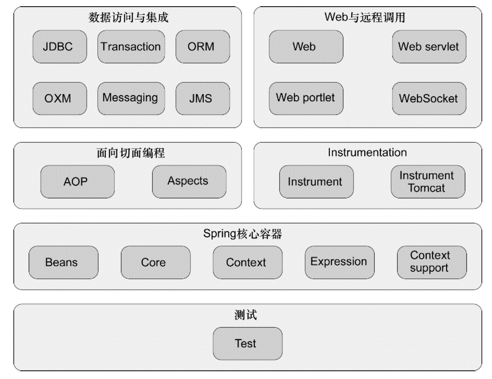
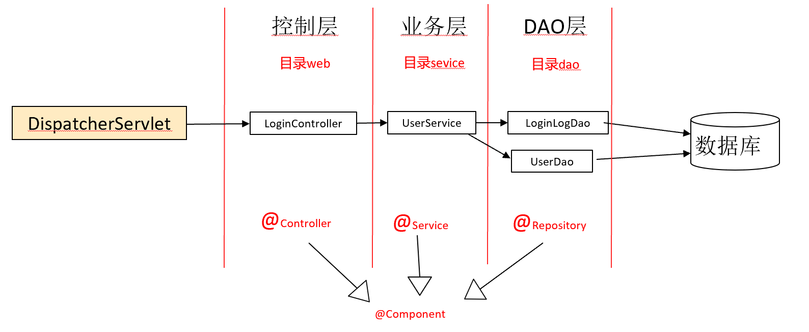
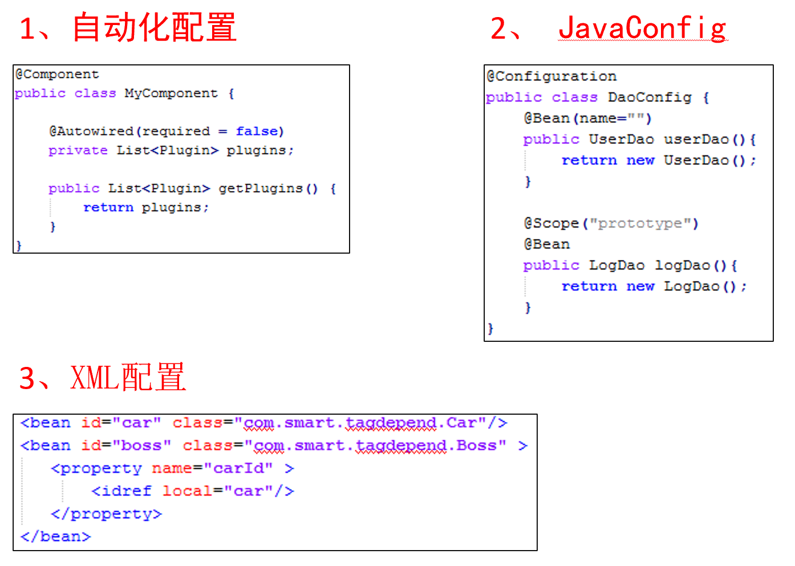
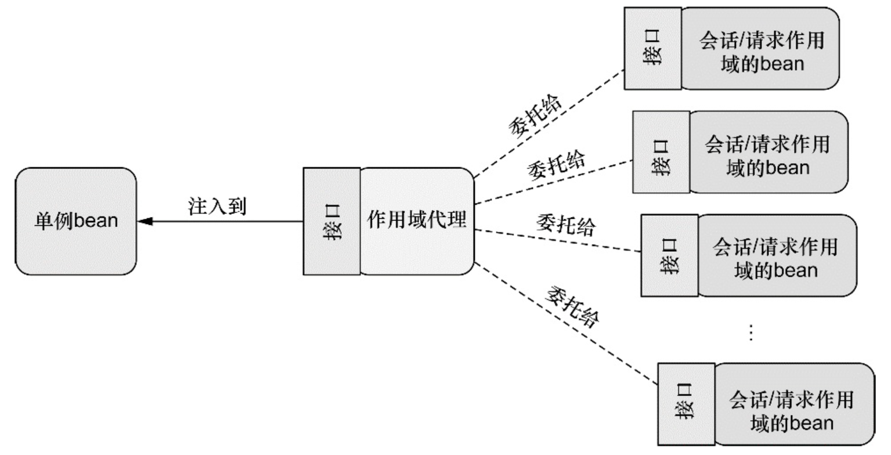

Exam0-课程复习
---

# 1. 后端开发学习建议
1. 至少精通一门编程语言，非常精通，不是能简单写几个程序，尽可能多学几门语言。
2. 熟练掌握一门编程框架，如java的Spring，Python的Django，前端的Vue
3. 会使用常用的工具，包括: IDE、Git
4. 会使用静态检查工具，如java的Finbugs（分析类内部、类间和类与外部的问题）、PMD、CheckStyle（代码格式化）等IDEA插件或Maven插件
5. 会单元测试工具，如java的JUnit、mockito、Coverage（覆盖率检查工具）、Cobertura
6. 会使用构建工具，如java的Maven，常用的mvn插件
7. 会使用数据库以及开发技术，MySQL是首选，其次用于测试的H2、SQLite也是需要的，另外ORM开发框架（mybatis、JPA等）也需要会一个
8. 会使用多个功能和性能自动化测试工具，提醒你们的是无论你将来做开发还是做测试，多掌握几个自动化测试工具对你们是非常有用的。
9. 其它的开发技术主是是以WEB开发、分布式(云计算)、大数据等为主要方向，能多学点，对你们将来也有利的。
10. 最后就是软件工程的知识，你们要知道一个软件开发项目是如何运转的，需求怎么做、设计怎么做、什么才是好代码、应该怎么做测试、版本如何管理、缺陷如何管理等，还有敏捷的价值观、优秀实践(TDD、CI/CD等)，这些知识也是必需的。

# 2. 第一节：概述

## 2.1. Spring是Java生态圈的主流编程框架
1. 轻量级（Lightweight）
2. 非侵入性（No intrusive）
3. 容器（Container）
4. **依赖注入(Dependency Injection)**
5. **面向切面编程(Aspect Oriented Programming)**
6. 持久层（JDBC封装、事务管理、ORM工具整合）
7. Web框架（MVC、其它WEB框架整合）
8. 其他企业服务的封装

## 2.2. Spring 的模块组成


## 2.3. 经典的基于Spring的典型Web分层架构示例


# 3. 第二节：依赖注入 —— Spring容器


## 3.1. Spring配置方案
1. Spring框架负责创建对象和建立之间的关系
2. 配置方法(告知Spring配置方案)
   1. XML：最早
   2. 自动化配置
   3. JavaConfig



3. 创建上下文方式：
   1. Config文件 + 注解
   2. XML实现配置

## 3.2. auto(section2-1)
1. `@componentScan`：声明扫描包内的Component，进行对应的实例化。
   1. 等价于：`<context:component-scan base-package="..."/>`
   2. 无参数：扫描当前文件所在包
   3. 有参数：
      1. 不安全的：({"包名", "包名"})
      2. 类型安全：(basePackageClasses = xxx.class)表示扫描该类所在的包
      3. marked interface：保证类型的安全，同时保证类的重构不影响它，在这个类底下添加一个稳定的接口(标签接口)
2. `@component`：告知框架，当前类需要实例化，等价于`@Named`
3. `@Autowired`：自动装配(注入)，可以放在构造函数、setter上，等价于`@Inject`
   1. 构造对象的时候调用构造函数或者setter
   2. required参数：默认为true，可以修改为false表示允许该值为null
   3. 不必与`@Bean`同时使用，加上`@Bean`的方法的参数可以自动注入
   4. 可能涉及到的POM配置文件如下

```xml
<!-- https://mvnrepository.com/artifact/javax.inject/inject-api -->
<dependency>
    <groupId>javax.inject</groupId>
    <artifactId>inject-api</artifactId>
    <version>1.0.0-PRD</version>
</dependency>


<!-- https://mvnrepository.com/artifact/javax.inject/com.springsource.javax.inject -->
<dependency>
    <groupId>javax.inject</groupId>
    <artifactId>com.springsource.javax.inject</artifactId>
    <version>1.0.0</version>
    <scope>provided</scope>
</dependency>
```

5. Spring的命名空间、XML文件配置法(`<context>`:命名空间)

## 3.3. JavaConfig(section2-2)
1. 没有`@Component`，依靠在Config中编写，是基于Java的配置
2. `@configuration`：声明一个配置类，告知框架读取配置
3. `@Bean(name="xxx")`：声明一个Bean，并且可以自定义名称
   1. Bean的默认名称为方法名
   2. 可以通过name字段修改bean的名称
   3. 可以有多个
4. Bean的实例个数
   1. 单实例(默认)：默认情况下多次调用创建多实，默认在一个容器里面。
   2. 多实例
   3. 使用`@Scope`进行修改：Scope，也称作用域，在Spring IoC容器是指其创建的 Bean 对象相对于其他 Bean 对象的请求可见范围。在 Spring IoC 容器中具有以下几种作用域：
      1. 基本作用域：
         1. `singleton`表示在spring容器中的单例，通过spring容器获得该bean时总是返回唯一的实例
         2. `prototype`表示每次获得bean都会生成一个新的对象(多实例)
      2. Web作用域
         1. `request`表示在一次http请求内有效(只适用于web应用)
         2. `session`表示在一个用户会话内有效(只适用于web应用)
            1. 会话建立时创建Bean，会话结束后销毁Bean
            2. Session Client和Server之间的一个Session，不同Client可能和Server建立多个Session，Request是一次请求和处理
         3. `globalSession`表示在全局会话内有效(只适用于web应用)：请求开始时创建Bean，请求结束后销毁Bean
      3. 自定义作用域

```java
// 使用会话和请求作用域
@Component
@Scope(value=WebApplicationContext.SCOPE_SESSION,
       proxyMode=ScopedProxyMode.INTERFACES)
public ShoppingCart cart(){....}
```

5. 一般情况下配置类和业务类会分包存储。

## 3.4. XML(section2-3)
1. bean:`<bean id = "bean_name">`
   1. 不能进行类型检查
   2. 有构造函数参数(构造器注入)
      1. 元素：每个参数一条
         1. 引用:`<constructor-arg ref="对象名">`
         2. 值:`<constructor-arg value ="参数内容、字面常量">`
      2. 属性：
         1. c-命名空间
         2. 建议按顺序取：编译结束后名称就已经不存在了
      3. 注入具体值
         1. 指定字面量值：(`<null/>`表示null)
         2. 指定集合：`<list>`和`<set>`，中间的值为`<value>xxx</value>`
   3. 属性方式注入(p name)
      1. set方式名字和properties name保持一致
      2. p命名空间不支持list
      3. `<util: list id>`可以存放多项，然后p引用该util(util命名空间)

```xml
<bean>
   <property name=".."  ref=".."/>
</bean>
<property name="..">
   <list>
      <value>
   </list>
</property>
<util:list id="...">
   <value>xxx</value>
</util:list>
```

2. xml文件名和测试类的名字一样，就不需要在测试的上下文配置中指定。
3. **强依赖建议使用构造器注入**

## 3.5. 混合(section2-4)
1. 混合配置：
   1. JavaConfig：类型检查简单
      1. `@Import(配置类.class, xxx)`
      2. `@ImportResource(xml文件)`
   2. xml：导入、.class文件不用调整
2. 配置文件(java 和 xml)里面可以import别人
   1. `<import resource = "xml文件"/>`
   2. `<bean class = "配置类"/>`
3. import可以import多个：xml里面，配置类写过的可以不仔细写

## 3.6. 控制容器实例化

### 3.6.1. @Profile
1. `@Profile`：不同情况下使用不同的bean，使用profile来控制，还可以使用Spring Boot的属性文件命名(含后缀)
   1. `dev`
   2. `prod`
2. 激活：激活的方式使用激活的三种方式。Spring Boot在java –jar时，使用-Dspring.profiles.active =sys会读取application-sys.properties文件来完成配置。如果没有添加profile则会帮你实例化出来（无论是否有profile的别的）
   1. `spring.profiles.default="dev"`
   2. `spring.profiles.active="prod"`
   3. `@ActiveProfiles("dev")`

```java
package com.myapp;
import org.springframework.context.annotation.Bean;
import org.springframework.context.annotation.Configuration;
import org.springframework.context.annotation.Profile;
import org.springframework.jdbc.datasource.embedded.EmbeddedDatabaseBuilder;
import org.springframework.jdbc.datasource.embedded.EmbeddedDatabaseType;
import org.springframework.jndi.JndiObjectFactoryBean;
import javax.sql.DataSource;
@Configuration
public class DataSourceConfig {
    @Bean(destroyMethod = "shutdown")
    @Profile("dev") // 开发环境
    public DataSource embeddedDataSource() {
        return new EmbeddedDatabaseBuilder()
                .setType(EmbeddedDatabaseType.H2)
                .addScript("classpath:schema.sql")
                .addScript("classpath:test-data.sql")
                .build();
    }
    @Bean
    @Profile("prod") //W生产环境
    public DataSource jndiDataSource() {
        JndiObjectFactoryBean jndiObjectFactoryBean = new JndiObjectFactoryBean();
        jndiObjectFactoryBean.setJndiName("jdbc/myDS");
        jndiObjectFactoryBean.setResourceRef(true);
        jndiObjectFactoryBean.setProxyInterface(javax.sql.DataSource.class);
        return (DataSource) jndiObjectFactoryBean.getObject();
    }
}
```

### 3.6.2. @Conditional
1. Conditional的**.class实现了Condition接口，自己决定什么时候创建这个Bean，什么时候不创建这个Bean
```java
@Bean
@Conditional(xxx.class)

public class xxx implements Conditonal{
   boolean matches(){...}
}
```

### 3.6.3. 自动装配的歧义性
1. `@Component` 或 `@Bean`
2. `@Primary`
3. 定义时
   1. `@Componet`或`@Bean`
   2. `@Qualifier("...")` 自定义限定符，通过使用`@Qualifier`注解，我们可以消除需要注入哪个bean的问题。
4. 使用时
   1. `@Autowired`
   2. `@Qualifier("…")`  bean名称或自定义限定符，默认Bean名是限定符
5. <a href = "https://juejin.cn/post/6844904035342893063">Spring 注解 @Qualifier 详细解析</a>
6. 可以自定义注解，这些注解本身也加了@Qualifier注解
   1. `@Cold`
   2. `@Creamy`

```java
@Qualifier
public @interface cold{
}
```

### 3.6.4. 通过代理注入给单例对象


```java
@Component
public class StoreService{ 
   // 单实例，注入每一个人创建的每一个购物车
   // Spring如何把一个会话范围的对象注入到一个单例对象中呢？Spring实际上注入的是一个代理对象
   // 最开始注入的时候Spring注入了一个代理对象，如果一开始是A的购物车，那么就会讲代理对象和对应的A的Bean对应起来
   @Autowired
   public void setShoppingCart(ShoppingCart shoppingCart){}
   // StoreService是单例对象
   // ShoppingCart是接口
   // shoppingCart是会话范围的对象
}
```

# 4. 面向切面编程 AOP

## 4.1. 概述
1. AOP：Aspect Oriented Programming
2. 发展史：
   1. POP：面向过程
   2. OOP：面向对象
   3. AOP：面向切面
   4. FP：函数式编程
   5. Rx：反应式编程(Java 9、Spring 5)

## 4.2. 概念
1. 横切关注点：切入的代码的功能或者关注点，业务代码不关注这部分点，eg：日志、安全等。
2. 通知(Advice)：切面做什么？什么时候做？代表了切面的逻辑。
3. 切点(Pointcut)：指定通知存放的位置，定义要改的方法和参数。
4. 切面(Aspect)：通知 + 切点
5. 连接点：通知 + 切点的实例化：也就是和业务代码连接的地方
6. 引入(Introduction)：(给对象)引入新的行为和状态
7. 织入(weaving)：切面应用到目标对象的过程

### 4.2.1. 通知类型
1. `@Before`：在调用目标之前
2. `@After`：被切的对象方法执行之后，等于`@AfterReturnning` + `@AfterThrowing`
3. `@AfterReturning`：被切对象方法返回后，有异常但是没有return的话不执行AfterReturning
4. `@AfterThrowing`：被切对象方法出现异常之后
5. `@Around`：被切对象方法的执行前和执行后，等于`@Before` + `@After`

### 4.2.2. 织入的时机
1. 编译器：编译的时候将Aspect织入进去，需要使用特别的编译器。
2. 类加载期：Spring不支持
3. 运行期(Spring 织入)：使用代理对象，就是获得的是切面对象的代理对象的引用，通过代理来操作，只支持方法级别的连接点

### 4.2.3. Spring AOP的两种支持类型
1. `@ApectJ`注解驱动的切面
   1. 切面表达式：表达切点
   2. 流程：写`@Aspect`->配置Config完成实例化和代理配置
   3. 多参数
   4. 语法：
      1. 对参数不感兴趣：√
      2. 对返回值或方法名不感兴趣：×
   5. <a href = "https://blog.mythsman.com/post/5d301cf2976abc05b34546be/">参考</a>
2. 纯POJO切面：通过XML而不是Spring注解，解决：比如想要将第三方无源码代码织入。

# 5. Web

## 5.1. 软件系统结构(C/S B/S)
1. C/S(Client)：客户机和服务器(有客户端，相当于安装软件)
2. B/S(Browser)：浏览器和服务器

## 5.2. 分层结构
1. 控制层：Controller
2. 业务层：Service(业务逻辑)
3. 持久化层(DAO)：repository(数据库访问)
   1. view层
   2. model层
   3. domain层(领域层)：把Java对象对应到数据库里的表

## 5.3. Spring MVC请求
1. Request：携带有URL和表单信息
2. 交给DispatchServlet
3. 查询handlerMapping，确定发往哪个Controller
4. Controller：得到携带的对象、URL信息、请求类型信息等，然后交给业务层，得到业务层的返回model和逻辑视图名
5. DispatchServlet：model和logical view name(str)
6. viewResolver：根据名字找界面
7. 得到View
8. 将View返回给客户端

## 5.4. 常见的上下文文件
1. web.xml
2. applicationContext.xml
3. 相对比较传统

# 6. Spring Web Flow
1. 开发基于流程的应用程序
2. 将流程定义、实现流程行为的类和视图分离开
3. 流程：看做是起点到终点间有很多小村庄
   1. 状态
      1. 视图
      2. 行为
      3. 决策
      4. 子流程
      5. 结束：可能不止一个
   2. 转移：
      1. to：目标状态
      2. on：事件
      3. on-exception：异常
      4. 全局转移：global-transitions
   3. 流程的数据：创建变量
      1. 全局有效:`<var name="order">`
      2. `<evaluate result="变量名和范围">`
         1. view范围：本页面
         2. flow范围：本流程

# 7. 数据持久化

## 7.1. JDBC、ORM和Hibernate

### 7.1.1. JDBC
1. 业务访问与持久化解耦
   1. 数据访问对象(DAO)或者Repository
   2. 业务对象 -> Repository接口 <- Repository实现(依赖倒置)
2. 异常处理：SQLException
   1. 非"运行时异常"，注意catch
   2. 链接断开、语法有误会导致这个异常
   3. 难以恢复、难以确定类型
   4. Spring：把异常变成运行时的DataAccessException(平台无关，让DAO层的异常不会被业务层直接发现)
3. 模板方法模式：定义过程的主要框架，template
   1. 资源管理
   2. 事务控制
   3. 异常管理
4. 配置**数据源**方法
   1. JNDI数据源：Java命名与目录接口
      1. Web容器(比如Tomcat)中配置JNDI参数，定义一个数据源(XML文件方式)
      2. 以Tomcat为例：在conf目录下的server.xml
      3. 驱动程序放到lib里面。
   2. 直接在Spring里面使用连接池化处理
      1. 很多第三方软件可以重用
      2. 可以在Java里或XML配置
      3. DBCP
   3. Spring 提供：JDBC驱动
      1. DriverManagerDataSource：没有连接池
      2. SingleConnectionDataSource：只有一个连接
      3. 开发或测试使用
   4. 用Spring配置嵌入式数据源:`<jdbc: >`
5. `@Profile("dev")`：配置环境，用来决定不同环境下选择哪一个进行实例化
   1. `@ActiveProfile`：指定当前环境
   2. 不改变源代码
6. RowMapper的接口的实现：lamada表达式负责将数据库字段映射到java对象的属性
7. 持续交付-部署流水线：共用一套测试版本，加入到制品库后的东西不能够重新编译添加。

### 7.1.2. ORM和Hibernate
1. ORM：对象关系映射(Object-Relational-Mapping)，在Java对象和关系型数据库之间的映射，实现直接存取Java对象，只是一套规范
   1. 不必编写RowMapper，不用关系对象是如何获得的，也不用担心一对多等问题
   2. 实现：Hibernate、Mybatis、JPA
2. Hibernate配置
   1. Session接口
   2. 获取SessionFactory对象
   3. 定义映射关系：XML、注解(JPA、Hibernate)
3. Hibernate的三类查询
   1. hql：对对象的SQL
   2. QBC：完全是对象风格的
   3. 本地SQL
4. `@Repository`注解：切入异常转换机制，实现持久化异常转换的Bean
5. JPA: Java 持久化 API，为POJO提供持久化标准规范
   1. JPQL：类似SQL
   2. EntityManager类似Hibernate的Session
   3. 并不真正注入EntityManager
      1. 线程不安全，每次操作前创造一个
      2. `@PersistentContext`告知Spring线程不安全

## 7.2. 非关系型数据库
1. MongoDB：文档式的存储。
2. Redis：集群间的数据共享、缓存。
3. 非关系型数据库不要求定义Schema，存储方式可以是多种多样的。

### 7.2.1. MongoDB

#### 7.2.1.1. 简介
1. C++编写，基于分布式文件存储的开源数据库系统
   1. 文档存储一般采用JSON格式
   2. 里面的对象自带时间属性
2. MongoDB Shell是它自带的Shell，Js的Shell，可以在里面敲JS
3. 术语：
   1. `database=database`
   2. `collection=table`
   3. `document=row`
   4. `field=column`
   5. 同一个Collection中的Document的Field可以不相同
4. 文档：
   1. 一次记录中有多个对象，要用另一张表Join，但是Mongo里可以存在一起
   2. 嵌套`.pretty()`显示的更格式化更好看

#### 7.2.1.2. 编程
1. 基于JDBC驱动：启动一个MongoDB的Client，获得DataBase，数据库操作，Close，和Spring本身没有关系
2. Spring Data MongoDB
   1. 需要添加Spring Data的依赖，包含类的时候可以直接存储
   2. 数据结构的定义注解是`@Document`，当前的数据类作为一个Document
   3. `@MongoRepository`：带参数、类名和ID类型。
   4. `@Query(json)`：筛选条件
      1. save会将class字段自动添加进入
3. 不同插入方式的效率问题
   1. Java-Faker：构造数据使用(需要添加依赖)
   2. JDBC快：Spring Data插进去了更多的字段

### 7.2.2. Redis

#### 7.2.2.1. 简介
1. key-value的Hash结构，存的是数据结构
   1. key-value是大小写。
   2. 可以指定key的消亡时间。
2. 内存数据库(缓存)
3. 可以做集群部署，master-slave结构，写给master，然后由master复制给slave们
   1. 集群环境下事务的处理 
   2. 集群环境下Message的处理、消息队列
4. key-value是大小写。
5. 可以查看数据类型
   1. string：如果发现是数值类型也可以做数值计算
   2. list：链表，往left或者right插入
      1. 可以阻塞等待，设置等待时间
      2. push和pop
   3. hash：`hm set key`
   4. set

#### 7.2.2.2. 编程
1. 连接Redis：
   1. 需要客户端连接
   2. 创建连接工厂，提供Template末班，Factory不指定则使用默认的连接(6379端口)
2. 要实现一个序列化接口
   1. 不推荐使用基于Java的序列化(字节序列)
   2. 比如换成jackson、json格式等

## 7.3. 缓存编程

### 7.3.1. 概述
1. 添加一层缓存，常用到的数据可以不从数据库中查找
2. 启用缓存
   1. `@`各种注解，在Repository层的接口中添加
   2. 配置类里面添加`@EnableCaching`
   3. 缓存管理器：Spring默认提供，但是一般用第三方
3. 利用AOP机制，在方法前后进行处理。

### 7.3.2. 缓存实现
1. (原生的)定义一个Bean，返回一个ConcurrentCacheManager：CacheEvict：从缓存中也删除。
2. EhCache：速度比较快
   1. 和程序运行在同一个进程内，提供一些额外的功能。
   2. 概念：
      1. Element：需要缓存的元素，维护键值对，可以设置有效期，可以包含多个信息。
      2. Cache：可以包含多个Element，由Manager管理，实现缓存的逻辑。
      3. CacheManager：容器对象，管理Cache生命周期
   3. 初始化Manager的时候需要XML配置，需要引入pom的引入，使用XML进行配置(XML中包含了每个Cache的配置)
   4. 使用Spring：
      1. import EhCache的包
      2. 使用工厂来完成实例化
3. RedisCache：分布式
   1. 3个Bean：模板、工厂、Manager
   2. 本地需要启动Redis

### 7.3.3. 注解
1. `@Cacheable`：先去缓存中查找，如果没有找到则去数据库中查找，并将结构缓存，参数是Cache的名字
   1. condition：缓存条件，可以禁用缓存
   2. unless：阻止引入
2. `@CachePut`：在数据库中粗出后将结果放入到缓存，而不会进数据库中找
3. `@CacheEvict`：从Cache中删除，`beforeInvocation`，调方法之前就删除

### 7.3.4. Key
1. 可以指定，使用元数据
2. `#result`：结果对象
3. `#参数名`：参数对象

# 8. Docker

## 8.1. 介绍
1. 容器是在Linux内核实现的轻量级隔离机制：
   1. 虚拟机是操作系统级别的资源隔离
   2. 容器本质上是进程级的资源隔离
2. 组成
   1. Docker Engine：一般在宿主主机后台运行
   2. 用户使用Client和Engine(Daemon)交互，可以通过pip、tcp进行交互
   3. index：交互，共有的大仓库，dockerhub
3. 使用GO语言实现

## 8.2. 使用
1. run
   + -d：后台运行容器，并返回容器ID
   + -i：以交互模式运行容器，通常与-t同时使用
   + -t：为容器重新分配一个伪输入终端，通常与-i同时使用
   + -p：指定(发布)端口映射，格式(主机(宿主)端口:容器端口)
   + -P：随机端口映射，容器内部端口随机映射到主机的高端口
   + --name = "docker_name"：为容器指定一个名称
   + -e env="value"：设置环境变量
   + --env-file="filename"：从指定文件中读入环境变量
   + --expose=2000-2002：开放(暴露)一个端口或一组端口
   + --link container_name:tag_name：添加链接到另一个容器，对于某个容器，跑的时候给要连接的另一个容器添加一个名字，就可以把那个容器映射到当前容器里
   + -v path_name：绑定一个卷(volumn)
   + --rm：退出时自动删除容器
2. container
   + `docker container ls`
   + `docker container ls -a`
   + `docker container ls -aq`
   + `docker inspect` 容器名：显示容器信息
   + `docker port` 容器名：显示端口映射信息
   + `docker logs -f <contioner id>` 查看容器内部的标准输出
   + `docker stop <container id>` 停止一个容器
   + `docker start <container id>` 启动已停止运行的容器
   + `docker restart <container id>` 正在运行的容器可以重启
   + `docker attach <container id>` 附着到容器
   + `docker exec -it <container id>` /bin/bash 进入容器，执行命令
   + `docker rm -f <container id>` 删除容器
   + `docker container prue`：清理掉所有处于终止状态的容器

## 8.3. Volumn
1. 镜像分层
   1. 镜像顶层可读写，底层不可写
   2. 写时复制：如果需要进行读写，进行提升
2. 数据卷
   1. Docker 管理卷：`docker volumn 命令`
   2. 绑定挂载卷：`-v`，挂载到容器内

## 8.4. 容器网络
1. `docker bridge`：所有的容器都联通到桥上，彼此间就可以连通。
   1. 桥有自己的网关，可以路由到虚拟机的网卡上，虚拟机又可以路由到外面的宿主机
   2. 两个虚拟机之间可以用overlay打通。
   3. 不建议挂载bridge上，因为需要`--link`才能彼此连通。
2. `host`：容器本身没有网卡，使用的是宿主机的网络。
3. 使用自己创建的网络
   1. 同一个网络下的各个容器，可以通过容器名直接连通
   2. 也可以到达虚拟机的网卡，连接宿主机
4. 自己创建的网络和真实的网络是一样的
5. 一个容器可以有多个网卡(IP地址)

# 9. 微服务

## 9.1. 单体 VS 微服务
1. 单体应用程序
   1. 数据库的表对所有模块可见
   2. 一个人的修改整个应用都要重新构建、测试、部署
   3. 整体复制分布式部署，不能拆分按需部署
2. 微服务
   1. 应用程序分解为具有明确定义了职责范围的**细粒度组件**
   2. 完全独立部署、独立测试，并且可以服用
   3. 使用轻量级通信协议(HTTP和JSON)，松耦合
   4. 服务实现可使用**多种编程语言和技术**
   5. 将大型团队划分成多个小型开发团队，每个团队只负责他们各自的服务。

## 9.2. 开发技术
1. 针对Java开发：Spring Boot和Spring Cloud
   1. Spring Boot：拿到开发具体的微服务，面向REST的微服务框架
   2. Spring Cloud：解决实施和部署微服务的问题。
2. REST原则：表现层状态转化
   1. 资源：网络上的一个实体，比如图、文档等等，标识为URI
   2. 表现层：可以认为是View，展现资源
   3. 状态转化
   4. HTTP协议的四个操作动词：Get、Get、Put、Delete

## 9.3. Spring Boot
1. starter：不是一个普通的jar包，可以做一些初始化
   1. 帮助创建Bean
   2. 代码里直接使用即可
2. 新注解`@RestController`：帮助完成序列化和反序列化
3. REST:
   1. Get：读
   2. Post：新增
   3. Put：更新
   4. Delete：删除
4. URI反应实体、资源的层次，是定位描述，前面可加一个版本号。
5. `@SpringBootApplication`：微服务启动入口
   1. 初始化
   2. `@Configuration`：实例化Bean
   3. ComponentScanner
6. 健康检查：url/health，返回服务的状态信息
7. 环境监测：url/env，返回服务的环境信息
8. actuator提供这部分的检查能力

## 9.4. Docker 镜像
1. 把为服务做成Docker镜像
2. 制作：
   1. Dockerfile的文本文件，放脚本
      1. FROM：从哪个镜像的基础上进行制作，必须有并且放在开头
      2. RUN：运行一些Linux指令
      3. CMD：容器启动后执行的命令，没有写则继承自基础镜像的CMD
      4. ADD：本地文件拷贝到容器
      5. COPY：类似ADD，但是不会解压
   2. 运行命令:`docker build -t image_name:tag_name 目录(上下文)`
3. 微服务打包之后，放到Docker容器里，默认起一下即可。

## 9.5. More
1. 远程通信：RPC协议，性能比较高
2. 普通的RESTful API相对更常用

# 10. 服务配置与服务编排

## 10.1. 服务配置
1. 将服务配置信息和代码分开
   1. 硬编码进入代码(不推荐)
   2. 分离的外部属性文件，与物理部署分离
   3. 使用配置服务来统一管理配置
2. 配置服务使用的存储类型
   1. 文件共享系统：volumn
   2. 源代码控制下的文件：Git
   3. 关系数据库
   4. Spring Cloud Config：文件系统、Git、Eureka

## 10.2. Spring Cloud配置服务器
可以放在Git仓库中，更优于文件系统

# 11. 服务发现、负载均衡

## 11.1. 服务发现
1. 找到合适的微服务以及实例
   1. 发现服务的IP
   2. 确定具体的示例
   3. 停止服务并通知
2. 启动全新的微服务，所有服务向这个服务注册和咨询
3. 好处：
   1. 可以快速水平伸缩而不是垂直伸缩，不影响客户端
      1. 水平伸缩：根据需求增减服务的实例
      2. 垂直伸缩：服务内增加更多的线程
   2. 更加具有弹性：容错性更强。
4. Eureka：
   1. 中间添加了一个Eureka Server，所有的服务都找他注册、发送状态
   2. 多个Eureka Server，保证可使用(信息需同步)

## 11.2. 负载均衡：Ribbon
1. 客户端负载均衡
2. 过程
   1. 从Eureka一次全取过来，然后按照一定频率进行更新
   2. 客户端侧维持一个列表，然后从列表中挑选。