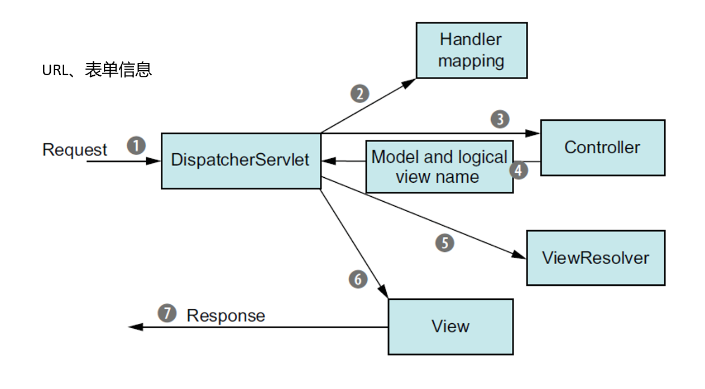

2021复习
---

25道多选，5道问答

# 1. 多选[2020]
1. 名为多选，实际上是不定项选择，并且全选对才有4分，少选只有1分。
2. 建议好好听课，如果听课前面的选择其实不太难。

# 2. 简答[2020]
1. web项目有哪些层次（分层）
2. 简述JDBC hibernate JPA的开发流程与特征
3. 微服务架构的特征，单体应用存在的问题
4. 简述服务发现与调用的开发流程（以eureka为例）
5. 简述服务网关的作用与开发流程（以zuul为例）

# 3. 选择[2021]
1. Spring也可以支持其他的第三方框架
2. 横切关注点包括哪些？安全、事务、日志、缓存
3. AOP通知：advice有哪些注解？
4. 要让AOP生效：@EnableAspectJS
5. 具备Component能力的注解
   1. Controller, Repository, Service,
   2. @Aspect是不是？
6. 实现控制器的时候RequestMapping可以加在？类、方法上面
7. 启动MVC @EnableSpringMVC @EnableWebMVC？
8. Controller返回的字符串，指向视图名Json 重定向 redirect
9. 数据源，通过jdbc 没有做池化处理？
10. 生产环境中：配置信息放到配置服务中
11. 业务层和data层用接口做隔离，好处是什么？
12. Hibernate的使用
    1. 获得session，拿到session接口后访问数据库
    2. 定义数据库表和对象的映射关系，直接通过注解方式
    3. Hql查询语言（支持标准sql查询语言）
13. Jpa实现数据访问层时需不需要定义数据库表和类的对应关系？（要）
14. Springdatajpa提供的接口是如何使用的？
15. 注解、命名、需不需要将方法原型写一遍，继承了什么接口（JpaRepository, CrudRepository）
16. Mongodb @document，是java.persitence定义的吗，还是谁定义的？
17. 存数据的操作，java对象不用做序列化（redis需要）
18. Mongodb的概念
    1. collection, database, document, field
    2. Shell的使用
19. Redis
    1.  特点
    2.  支持的数据类型
20. Escache和redis的区别
    1. Escache支不支持数据的持久化
    2. 使用缓存编程的常用注解
21. 容器
    1. 和虚拟机的区别
    2. Docker run常用命令参数
    3. -P随机端口 –d后台运行
    4. Docker管理命令
22. SpringBoot和Spring-cloud的关系
23. 配置服务：本身基于springboot开发，
24. Spring-cloud能解决的问题
25. 当一个服务需要获取配置数据时，需要向配置服务获取数据，配置服务如何知道要获取的是哪个数据？服务名和profile
26. 实现配置服务需要在启动类上加注解？@EnableConfigServer
27. 使用配置服务的客户端需要加什么注解？
28. 在服务网关处可以实现哪些能力?用户认证和授权，静态路由、动态路由，数据收集，日志

# 4. 简答[2021]
1. 控制器、业务层、数据访问层、领域模型，以及mvc的view和model
   1. 
2. Dispatchservlet整个处理过程
   1. 第一步：携带有URL和表单信息的Request达到DispatchServlet
   2. 第二步：DispatchServlet去Handler mapping中查找映射关系
   3. 第三步：根据查找到的映射关系，将Request交给具体对应的Controller
   4. 第四步：Controller得到携带的URL和表单信息等，在交给业务层处理后，得到业务层返回的Model和logical的视图名
   5. 第五步：DispatchServlet得到对应的model和logical view name(str)，并向ViewResolver根据名称查找界面
   6. 第六步：DispatchServlet得到查找到的View界面
   7. 第七步：将View放置在Response中返回给客户端

3. 微服务有什么特征？单体应用有什么不足
   1. 单体应用程序
      1. 数据库的表对所有模块可见
      2. 一个人的修改整个应用都要重新构建、测试、部署
      3. 整体复制分布式部署，不能拆分按需部署
   2. 微服务
      1. 应用程序分解为具有明确定义了职责范围的**细粒度组件**
      2. 完全独立部署、独立测试，并且可以服用
      3. 使用轻量级通信协议(HTTP和JSON)，松耦合
      4. 服务实现可使用**多种编程语言和技术**
      5. 将大型团队划分成多个小型开发团队，每个团队只负责他们各自的服务。
4. 服务注册与发现的好处
   1. 可以快速水平伸缩而不是垂直伸缩，不影响客户端
      1. 水平伸缩：根据需求增减服务的实例
      2. 垂直伸缩：服务内增加更多的线程
   2. 更加具有弹性：容错性更强。
5. eureka、zuul、feign、ribbon的相互关系
   1. Eureka：
      1. 中间添加了一个Eureka Server，所有的服务都找他注册、发送状态
      2. 多个Eureka Server，保证可使用(信息需同步)
   2. Zuul
   3. Feign
   4. Ribbon：服务端负载均衡