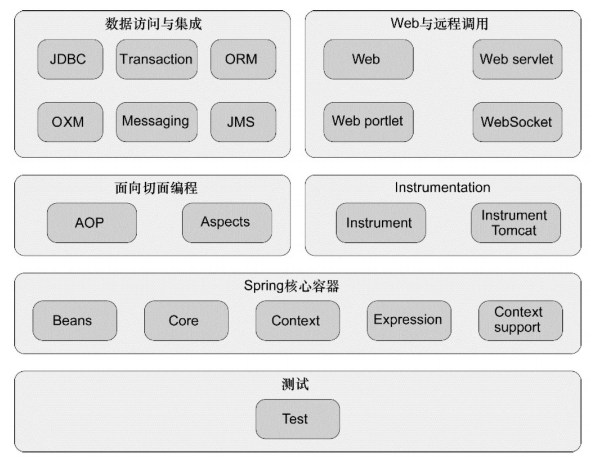
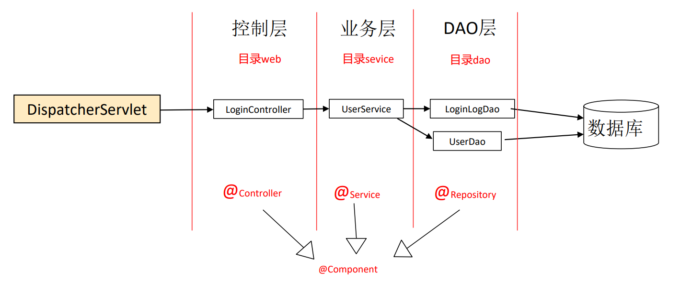
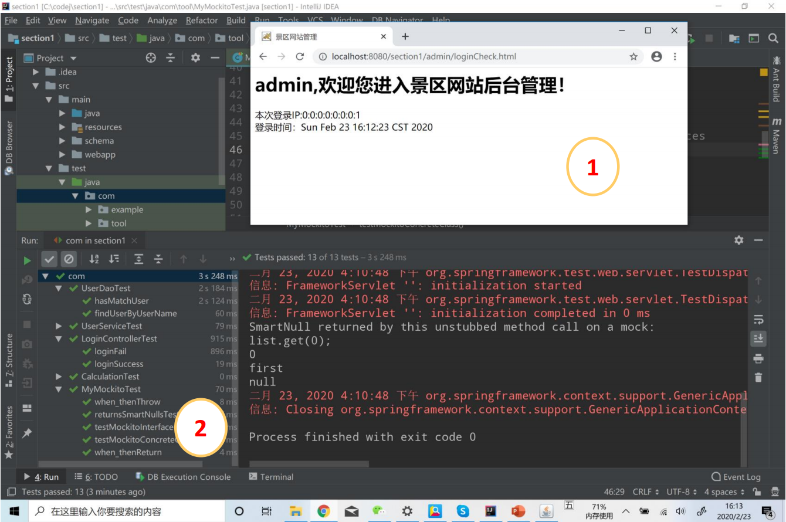

Lecture1-架构模式的演进与编程框架
---

# 1. 课程环境配置
1. JDK：1.8.0_241
2. Maven：3.6.1(建议配置国内镜像服务器)
3. IJ和插件：Database Navigator
4. MySQL：5.7.29
5. Tomcat-8

# 2. Spring是java生态圈的主流编程框架
1. 轻量级（Lightweight）
2. 非侵入性（No intrusive）
3. 容器（Container）
4. 依赖注入(Dependency Injection)
5. 面向切面编程(Aspect Oriented Programming)
6. 持久层（JDBC封装、事务管理、ORM工具整合）
7. Web框架（MVC、其它WEB框架整合）
8. 其他企业服务的封装

# 3. Spring的模块组成

# 4. 基于Spring的典型Web分层架构示例

# 5. 代码构建、部署、运行
1. 简化Java开发
   1. DI、jdbcTemplate、AOP
2. 代码执行路径
3. jetty插件

# 6. 作业

